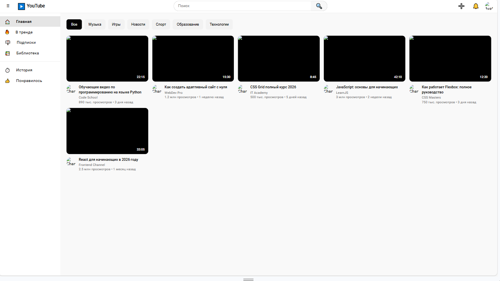
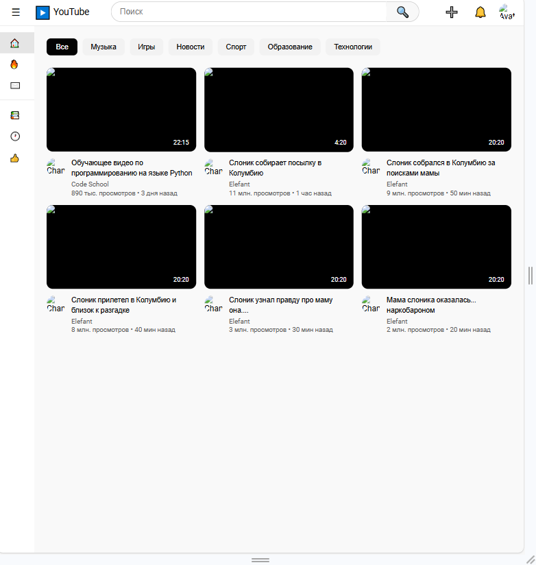

# YouTube Clone - Лабораторная работа №10-11

**Студент:** [Щербаков Данил Николаевич]
**Группа:** [ИСП-232]

---

## Описание
Адаптивный клон главной страницы YouTube, созданный с использованием HTML, CSS, Flexbox и CSS Grid. Проект включает шапку с поиском, боковую панель навигации, блок категорий (чипсы) и сетку видео с карточками.

## Реализованные функции
- [x] Адаптивный хедер с поиском
- [x] Боковая панель навигации с иконками
- [x] Категории (чипсы) с интерактивностью
- [x] Сетка видео с карточками (CSS Grid)
- [x] Hover-эффекты на карточках (подъём, тень, масштабирование)
- [x] Полная адаптивность под все устройства (медиа-запросы)

## Технологии
- HTML5
- CSS3
- Flexbox
- CSS Grid
- Media Queries

## Скриншоты
### Desktop (1920px)

### Tablet (1024px)

### Mobile (375px)

## Как запустить
1. Откройте файл `index.html` в браузере.
2. Или используйте **Live Server** в VS Code:
   - Установите расширение Live Server
   - Правой кнопкой по `index.html` → Open with Live Server

## Структура проекта
- `index.html` – главная страница
- `style.css` – все стили проекта
- `img/` – папка со скриншотами

В ходе выполнения лабораторной работы я изучил основы адаптивной вёрстки, освоил работу с Flexbox и CSS Grid, научился создавать интерактивные элементы с помощью CSS. Проект помог мне лучше понять принципы создания современных веб-интерфейсов.

## Дата выполнения
[17.02.2026]